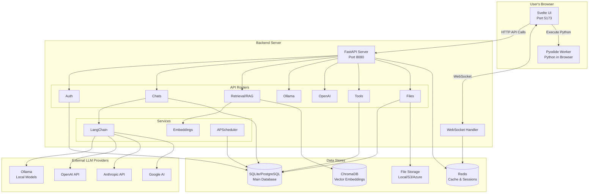
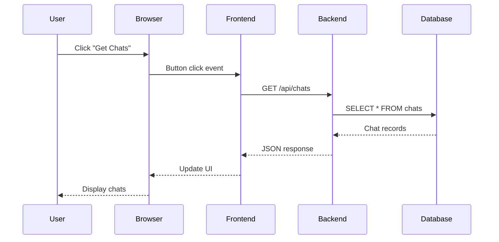
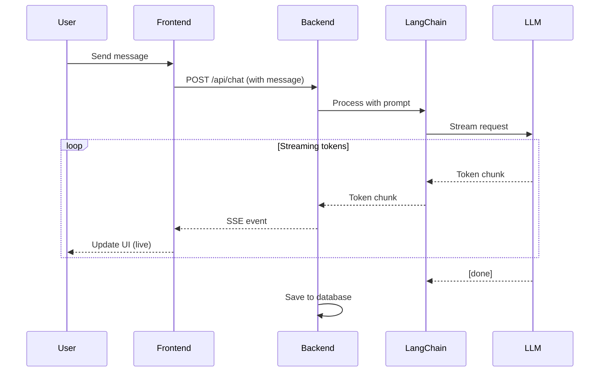
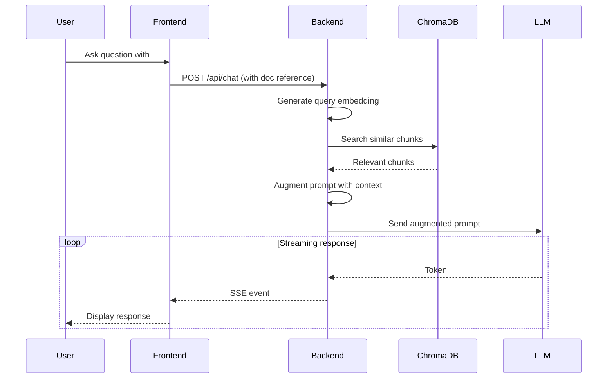
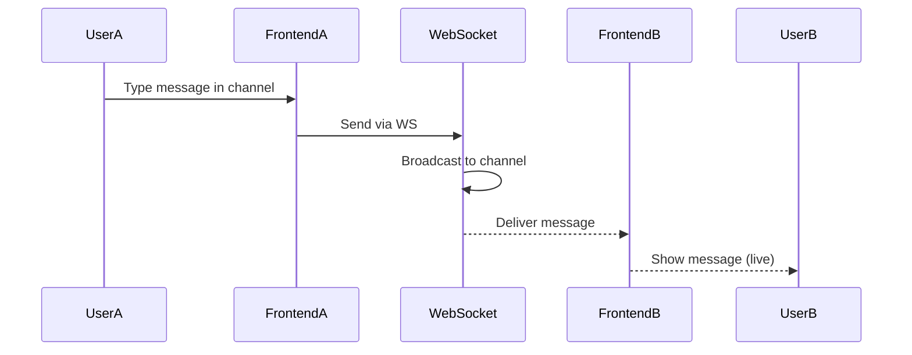

# Architecture Overview

**Welcome to the Open WebUI architecture guide!** This document explains the high-level system design and how components work together.

**Estimated reading time:** 45-60 minutes
**Prerequisites:** Basic understanding of web applications
**Documented:** November 18, 2025

---

## 📋 Table of Contents

1. [System Overview](#system-overview)
2. [High-Level Architecture](#high-level-architecture)
3. [Frontend Architecture](#frontend-architecture)
4. [Backend Architecture](#backend-architecture)
5. [Data Flow](#data-flow)
6. [Key Components](#key-components)
7. [Technology Choices](#technology-choices)
8. [Deployment Architecture](#deployment-architecture)
9. [Next Steps](#next-steps)

---

## System Overview

### What is Open WebUI?

Open WebUI is a **self-hosted AI chat platform** that combines:

```
┌─────────────────────────────────────────────────────┐
│                    Open WebUI                        │
│                                                      │
│  ┌──────────────┐  ┌──────────────┐  ┌───────────┐ │
│  │ Chat         │  │ RAG/Knowledge│  │ Admin     │ │
│  │ Interface    │  │ Management   │  │ Panel     │ │
│  └──────────────┘  └──────────────┘  └───────────┘ │
│                                                      │
│  ┌──────────────┐  ┌──────────────┐  ┌───────────┐ │
│  │ Workspaces   │  │ Collaboration│  │ Tools &   │ │
│  │ & Notes      │  │ (Channels)   │  │ Functions │ │
│  └──────────────┘  └──────────────┘  └───────────┘ │
└─────────────────────────────────────────────────────┘
```

**Core Features:**
- 💬 **Multi-LLM Chat** - Works with Ollama, OpenAI, Anthropic, Google AI, and more
- 📚 **RAG (Retrieval Augmented Generation)** - Chat with your documents
- 👥 **Multi-User** - Complete user management and permissions
- 🔄 **Real-time Collaboration** - Channels with live updates
- 🎨 **Rich UI** - Code editor, image generation, voice/video calls
- 🧩 **Extensible** - Functions, tools, and pipelines for custom logic

### 🧠 Mental Model: Three Layers

Think of Open WebUI as three distinct layers:

```
┌────────────────────────────────────────┐
│  Presentation Layer (Svelte)           │  ← What users see
│  - UI components                       │
│  - State management                    │
│  - Real-time updates                   │
└────────────────────────────────────────┘
              ↕ HTTP/WebSocket
┌────────────────────────────────────────┐
│  Application Layer (FastAPI)           │  ← Business logic
│  - API endpoints                       │
│  - LLM integrations                    │
│  - Authentication                      │
│  - File processing                     │
└────────────────────────────────────────┘
              ↕ ORM/Queries
┌────────────────────────────────────────┐
│  Data Layer (SQLite/PostgreSQL)        │  ← Persistent storage
│  - User data                           │
│  - Chats & messages                    │
│  - Documents & embeddings              │
└────────────────────────────────────────┘
```

🌉 **React Developers:** Similar to React + Express + Postgres
🌉 **Next.js Developers:** Similar to Next.js API routes, but separate servers
🌉 **Django Developers:** Similar to Django, but frontend is fully separate

---

## High-Level Architecture

### System Architecture Diagram



### 🎯 Key Architectural Decisions

| Decision | Choice | Rationale |
|----------|--------|-----------|
| **Frontend Framework** | Svelte 5 | Smaller bundle size, better performance than React |
| **Backend Framework** | FastAPI | Modern async Python, automatic API docs, fast |
| **Database ORM** | SQLAlchemy 2.0 | Most mature Python ORM, supports multiple DBs |
| **Real-time** | WebSockets (Socket.io) | Bidirectional communication for collaboration |
| **Vector DB** | ChromaDB | Simple setup, Python-native, good for RAG |
| **LLM Framework** | LangChain | Unified interface for multiple LLM providers |
| **Build Tool** | Vite | Extremely fast HMR, modern bundler |
| **Styling** | Tailwind CSS v4 | Utility-first, highly customizable |

---

## Frontend Architecture

### Technology Stack

```
┌────────────────────────────────────┐
│      Svelte 5 (Runes API)          │  ← Component framework
└────────────────────────────────────┘
┌────────────────────────────────────┐
│    SvelteKit 2 (Meta-framework)    │  ← Routing, SSR, build
└────────────────────────────────────┘
┌────────────────────────────────────┐
│  TypeScript 5.5 (Type Safety)      │  ← Static typing
└────────────────────────────────────┘
┌────────────────────────────────────┐
│  Tailwind CSS v4 (Styling)         │  ← Utility CSS
└────────────────────────────────────┘
┌────────────────────────────────────┐
│     Vite 5 (Build Tool)            │  ← Dev server + bundler
└────────────────────────────────────┘
```

### Frontend Layer Breakdown

```
┌─────────────────────────────────────────────────┐
│  UI Components (Svelte)                         │
│  - Chat interface                               │
│  - Admin panel                                  │
│  - Workspace/Notes                              │
│  - Settings modals                              │
└─────────────────────────────────────────────────┘
                    ↕
┌─────────────────────────────────────────────────┐
│  State Management (Stores)                      │
│  - User state                                   │
│  - Chat state                                   │
│  - Models & tools                               │
│  - UI state (modals, etc.)                      │
└─────────────────────────────────────────────────┘
                    ↕
┌─────────────────────────────────────────────────┐
│  API Client Layer                               │
│  - REST API calls                               │
│  - WebSocket connections                        │
│  - Request/response handling                    │
└─────────────────────────────────────────────────┘
                    ↕
┌─────────────────────────────────────────────────┐
│  Special Features                               │
│  - Pyodide (Python in browser)                  │
│  - TipTap (Rich text editing)                   │
│  - CodeMirror (Code editing)                    │
│  - Chart.js (Visualizations)                    │
└─────────────────────────────────────────────────┘
```

### ✅ Current (Nov 2025) Frontend Patterns

**Svelte 5 Runes** (🆕 New paradigm!)
```svelte
<script lang="ts">
  // ✅ CURRENT: Svelte 5 Runes
  let count = $state(0);
  let doubled = $derived(count * 2);

  $effect(() => {
    console.log('Count changed:', count);
  });

  // ❌ OUTDATED: Svelte 3/4 patterns
  // let count = 0;
  // $: doubled = count * 2;
  // $: console.log('Count changed:', count);
</script>
```

**See:** [FRONTEND_ARCHITECTURE.md](./FRONTEND_ARCHITECTURE.md) for deep dive

---

## Backend Architecture

### Technology Stack

```
┌────────────────────────────────────┐
│   Python 3.11-3.12 (Language)      │  ← Modern Python
└────────────────────────────────────┘
┌────────────────────────────────────┐
│   FastAPI 0.118 (Web Framework)    │  ← Async API framework
└────────────────────────────────────┘
┌────────────────────────────────────┐
│   SQLAlchemy 2.0 (ORM)             │  ← Database access
└────────────────────────────────────┘
┌────────────────────────────────────┐
│   Pydantic v2 (Validation)         │  ← Data validation
└────────────────────────────────────┘
┌────────────────────────────────────┐
│   Uvicorn (ASGI Server)            │  ← Production server
└────────────────────────────────────┘
```

### Backend Layer Breakdown

```
┌─────────────────────────────────────────────────┐
│  API Routers (FastAPI)                          │
│  /api/auths     - Authentication                │
│  /api/chats     - Chat management               │
│  /api/retrieval - RAG/vector search             │
│  /api/ollama    - Ollama integration            │
│  /api/openai    - OpenAI integration            │
│  /api/files     - File uploads                  │
│  /api/tools     - Custom tools                  │
│  ...and 20+ more routers                        │
└─────────────────────────────────────────────────┘
                    ↕
┌─────────────────────────────────────────────────┐
│  Business Logic Services                        │
│  - LangChain orchestration                      │
│  - Embedding generation                         │
│  - Document processing                          │
│  - Background tasks                             │
└─────────────────────────────────────────────────┘
                    ↕
┌─────────────────────────────────────────────────┐
│  Data Access Layer                              │
│  - SQLAlchemy models                            │
│  - Database queries                             │
│  - Vector database operations                   │
└─────────────────────────────────────────────────┘
                    ↕
┌─────────────────────────────────────────────────┐
│  External Integrations                          │
│  - LLM providers (Ollama, OpenAI, etc.)         │
│  - Storage backends (S3, Azure, Local)          │
│  - Cache (Redis)                                │
└─────────────────────────────────────────────────┘
```

### Router Organization

**File:** [backend/open_webui/main.py](../../backend/open_webui/main.py)

```python
# All routers imported and registered
from open_webui.routers import (
    audio,        # Audio/TTS/STT
    auths,        # Authentication
    channels,     # Real-time collaboration
    chats,        # Chat management
    configs,      # Configuration
    evaluations,  # Model evaluations
    files,        # File uploads
    folders,      # Organization
    functions,    # Custom Python functions
    groups,       # User groups
    images,       # Image generation
    knowledge,    # Knowledge bases
    memories,     # Conversation memory
    models,       # Model management
    notes,        # Notes feature
    ollama,       # Ollama integration
    openai,       # OpenAI/compatible APIs
    pipelines,    # Custom pipelines
    prompts,      # Prompt templates
    retrieval,    # RAG/vector search
    scim,         # SCIM provisioning
    tasks,        # Background tasks
    tools,        # Custom tools
    users,        # User management
    utils,        # Utilities
)
```

**See:** [BACKEND_ARCHITECTURE.md](./BACKEND_ARCHITECTURE.md) for deep dive

---

## Data Flow

### Request/Response Flow

#### 1. Simple API Request



#### 2. LLM Chat Flow (Streaming)



#### 3. RAG Query Flow



#### 4. Real-time Collaboration



**See:** [DATA_FLOW_GUIDE.md](./DATA_FLOW_GUIDE.md) for detailed flows

---

## Key Components

### 1. Authentication System

**Location:** [backend/open_webui/routers/auths.py](../../backend/open_webui/routers/auths.py)

**Features:**
- JWT-based authentication
- Session management (Redis)
- OAuth support (Azure AD, Google, LDAP)
- SCIM 2.0 provisioning
- Role-based access control (RBAC)

**Flow:**
```
Login → Validate credentials → Generate JWT → Store session → Return token
```

### 2. RAG (Retrieval Augmented Generation)

**Location:** [backend/open_webui/routers/retrieval.py](../../backend/open_webui/routers/retrieval.py)

**Components:**
- **Document Processing** - Parse PDF, DOCX, TXT, etc.
- **Embedding Generation** - sentence-transformers or API
- **Vector Storage** - ChromaDB, Milvus, Qdrant, etc.
- **Retrieval** - Similarity search + reranking
- **Context Injection** - Augment LLM prompts

**🔍 Needs Verification:** Reranking implementation details

### 3. LLM Integration Layer

**LangChain v0.3** (⚠️ Deprecated, v1.0 available)

**Supported providers:**
- Ollama (local models)
- OpenAI (GPT-3.5, GPT-4, etc.)
- Anthropic (Claude)
- Google AI (Gemini)
- Azure OpenAI
- Custom OpenAI-compatible endpoints

**Location:**
- [backend/open_webui/routers/ollama.py](../../backend/open_webui/routers/ollama.py)
- [backend/open_webui/routers/openai.py](../../backend/open_webui/routers/openai.py)

### 4. Real-time Collaboration (Channels)

**Location:** [backend/open_webui/socket/](../../backend/open_webui/socket/)

**Technology:** Socket.io (WebSockets)

**Features:**
- Live chat updates
- Typing indicators
- User presence
- Channel-based rooms

### 5. Functions & Tools System

**Functions:** Custom Python code executed server-side
**Tools:** Integrations with external services

**Location:**
- [backend/open_webui/routers/functions.py](../../backend/open_webui/routers/functions.py)
- [backend/open_webui/routers/tools.py](../../backend/open_webui/routers/tools.py)

**Use cases:**
- Custom data processing
- API integrations
- Webhook handling
- Rate limiting

### 6. Pyodide Integration (Python in Browser)

**Location:** [src/lib/pyodide/](../../src/lib/pyodide/)

**Purpose:** Execute Python code client-side for:
- Code interpreter
- Data analysis
- Visualization
- Custom functions

**✅ CURRENT:** Pyodide 0.28 with Python 3.13

---

## Technology Choices

### Why Svelte 5?

**Advantages:**
- ✅ Smaller bundle sizes than React (~30-40% smaller)
- ✅ Better runtime performance (no virtual DOM)
- ✅ Less boilerplate code
- ✅ Built-in reactivity (no hooks complexity)
- ✅ Excellent TypeScript support

**Comparison to React:**
| Feature | React | Svelte 5 |
|---------|-------|----------|
| Bundle size | ~45kb (min+gzip) | ~15kb (min+gzip) |
| Reactivity | Hooks + setState | Runes ($state) |
| Learning curve | Moderate | Gentle |
| Ecosystem | Massive | Growing |
| Performance | Good | Excellent |

### Why FastAPI?

**Advantages:**
- ✅ Async/await native (better concurrency)
- ✅ Automatic API documentation (Swagger/OpenAPI)
- ✅ Type validation with Pydantic
- ✅ Excellent performance (comparable to Node.js)
- ✅ Modern Python patterns

**Comparison to Express:**
| Feature | Express | FastAPI |
|---------|---------|---------|
| Language | JavaScript | Python |
| Async | Callbacks/Promises | async/await native |
| Validation | Manual (Joi, etc.) | Built-in (Pydantic) |
| Docs | Manual | Auto-generated |
| Typing | TypeScript (opt) | Python types (native) |

### Why SQLAlchemy 2.0?

**Advantages:**
- ✅ Supports multiple databases (SQLite, PostgreSQL, MySQL)
- ✅ Powerful query builder
- ✅ Excellent async support
- ✅ Migrations with Alembic
- ✅ Mature and stable

**⚠️ Important:** SQLAlchemy 2.0 is COMPLETELY different from 1.x
- New `select()` syntax
- Better type checking
- Improved async patterns

### Why ChromaDB?

**Advantages:**
- ✅ Python-native (easy integration)
- ✅ Simple setup (no external services needed)
- ✅ Good for development and small-medium scale
- ✅ Multiple embedding functions supported

**Alternatives supported:**
- Milvus (better for large scale)
- Qdrant (faster queries)
- Pinecone (cloud-hosted)
- Postgres with pgvector

---

## Deployment Architecture

### Development (Local)

```
┌──────────────────┐     ┌──────────────────┐
│  Vite Dev Server │     │ FastAPI + Uvicorn│
│  localhost:5173  │────>│  localhost:8080  │
└──────────────────┘     └──────────────────┘
                                  │
                         ┌────────┴────────┐
                         │                 │
                    ┌────▼────┐      ┌────▼────┐
                    │ SQLite  │      │ ChromaDB│
                    │   DB    │      │ (local) │
                    └─────────┘      └─────────┘
```

### Production (Docker)

```
┌─────────────────────────────────────────┐
│          Nginx/Caddy (Reverse Proxy)    │
│               Port 80/443               │
└───────────────┬─────────────────────────┘
                │
        ┌───────┴───────┐
        │               │
   ┌────▼────┐    ┌─────▼─────┐
   │ Static  │    │  FastAPI  │
   │  Files  │    │   Backend │
   └─────────┘    └────┬──────┘
                       │
              ┌────────┼────────┐
              │        │        │
         ┌────▼──┐ ┌───▼───┐ ┌─▼──────┐
         │ Postgres│ │Redis │ │ChromaDB│
         │   DB    │ │Cache │ │ Vector │
         └─────────┘ └──────┘ └────────┘
```

### Production (Kubernetes)

```
┌──────────────────────────────────────┐
│           Ingress Controller         │
└────────────┬─────────────────────────┘
             │
    ┌────────┴────────┐
    │                 │
┌───▼────┐      ┌─────▼──────┐
│Frontend│      │  Backend   │
│  Pod   │      │    Pod     │
└────────┘      └─────┬──────┘
                      │
         ┌────────────┼────────────┐
         │            │            │
    ┌────▼───┐   ┌───▼──┐   ┌─────▼────┐
    │ PostgreSQL  │Redis │   │ChromaDB  │
    │ StatefulSet │ Pod  │   │  Pod     │
    └────────┘   └──────┘   └──────────┘
```

**📍 See:** [kubernetes/](../../kubernetes/) for deployment manifests

---

## Security Architecture

### Authentication Flow

```
User → Login → JWT Token → Store in httpOnly Cookie
                              ↓
                    All API requests include cookie
                              ↓
                    Middleware validates JWT
                              ↓
                    Attach user to request
```

### Authorization (RBAC)

**Roles:**
- **Admin** - Full access
- **User** - Standard access
- **Pending** - Awaiting approval

**Permissions:**
- Model access control
- Function/tool execution rights
- File upload limits
- API rate limiting

**📍 See:** [SECURITY_GUIDE.md](./SECURITY_GUIDE.md) for details

---

## Performance Considerations

### Frontend Optimization

- ✅ Code splitting (SvelteKit automatic)
- ✅ Lazy loading of components
- ✅ Service Worker (PWA)
- ✅ Image optimization
- ✅ Minimal dependencies

### Backend Optimization

- ✅ Async/await throughout
- ✅ Database connection pooling
- ✅ Redis caching
- ✅ Response compression
- ✅ Background tasks (APScheduler)

### Database Optimization

- ✅ Proper indexing
- ✅ Connection pooling
- ✅ Query optimization
- ⚠️ **ASSUMPTION:** N+1 query prevention (needs verification)

---

## Comparison to Similar Systems

### Open WebUI vs. ChatGPT Web

| Feature | Open WebUI | ChatGPT |
|---------|-----------|---------|
| Self-hosted | ✅ Yes | ❌ No |
| Multi-LLM | ✅ Yes | ❌ GPT only |
| RAG/Docs | ✅ Built-in | ⚠️ Limited |
| Customizable | ✅ Fully | ❌ No |
| Open Source | ✅ Yes | ❌ No |
| Privacy | ✅ Full control | ⚠️ Data sent to OpenAI |

### Open WebUI vs. LangChain UI

| Feature | Open WebUI | LangChain UI |
|---------|-----------|--------------|
| Full app | ✅ Complete | ⚠️ Framework |
| Multi-user | ✅ Yes | ❌ No |
| Admin panel | ✅ Yes | ❌ No |
| Production ready | ✅ Yes | ⚠️ Depends |

---

## Next Steps

Now that you understand the architecture:

1. 📖 **Detailed structure:** [PROJECT_STRUCTURE.md](./PROJECT_STRUCTURE.md)
   - Where every file lives

2. 🧠 **Technology deep dives:**
   - [TECH_STACK_GUIDE.md](./TECH_STACK_GUIDE.md) - All technologies explained
   - [FRONTEND_ARCHITECTURE.md](./FRONTEND_ARCHITECTURE.md) - Svelte 5 deep dive
   - [BACKEND_ARCHITECTURE.md](./BACKEND_ARCHITECTURE.md) - FastAPI deep dive

3. 🌊 **Trace data flow:** [DATA_FLOW_GUIDE.md](./DATA_FLOW_GUIDE.md)
   - Follow requests end-to-end

4. 🛠️ **Start building:** [HOW_TO_GUIDE.md](./HOW_TO_GUIDE.md)
   - Add features step-by-step

---

## Summary

**Open WebUI is:**
- ✅ Modern full-stack TypeScript/Python app
- ✅ Microservices-inspired (separate frontend/backend)
- ✅ Real-time capable (WebSockets)
- ✅ AI-native (LLM integrations, RAG)
- ✅ Production-ready (Docker, K8s)
- ✅ Extensible (Functions, tools, pipelines)

**Key technologies:**
- Frontend: Svelte 5 + SvelteKit 2 + TypeScript
- Backend: Python FastAPI + SQLAlchemy 2.0
- AI: LangChain + ChromaDB + Transformers
- Infrastructure: Docker + Redis + SQLite/PostgreSQL

**Recommended next read:** [PROJECT_STRUCTURE.md](./PROJECT_STRUCTURE.md) →

---

**Last updated:** November 18, 2025
**Tech stack research:** [TECH_STACK_RESEARCH.md](./TECH_STACK_RESEARCH.md)
