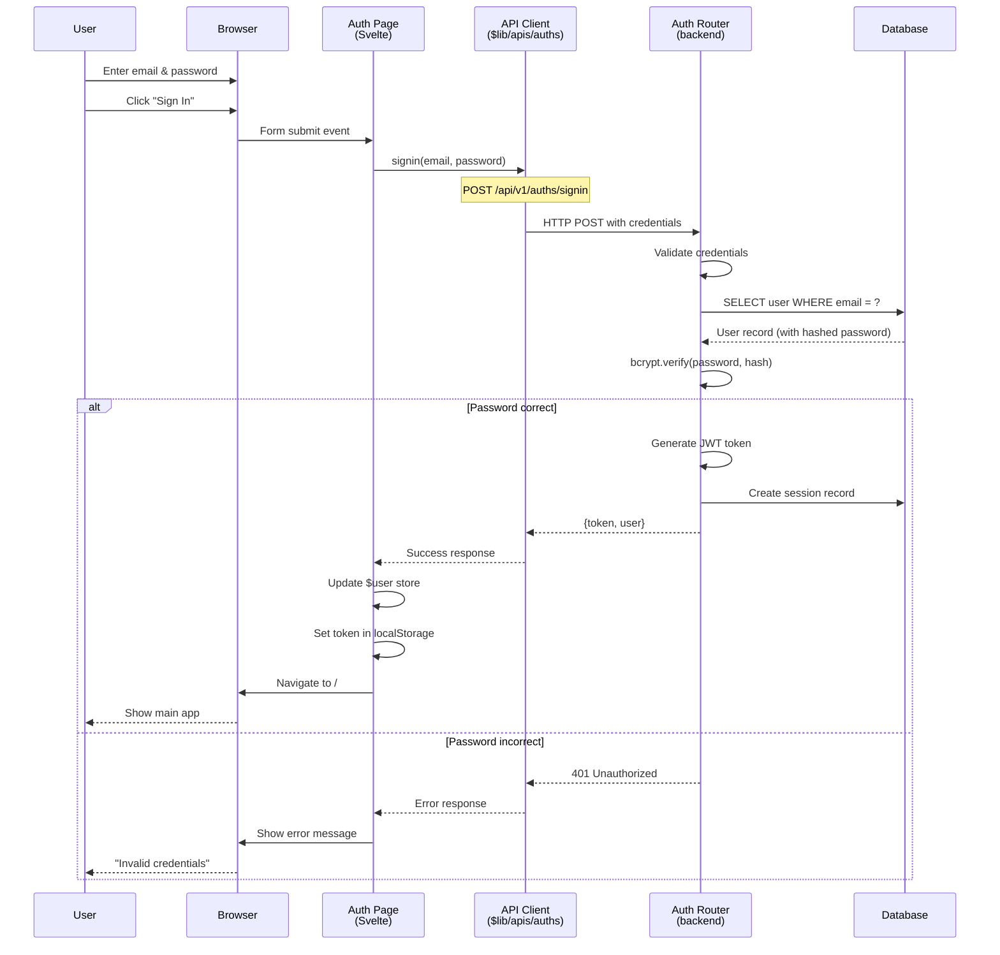
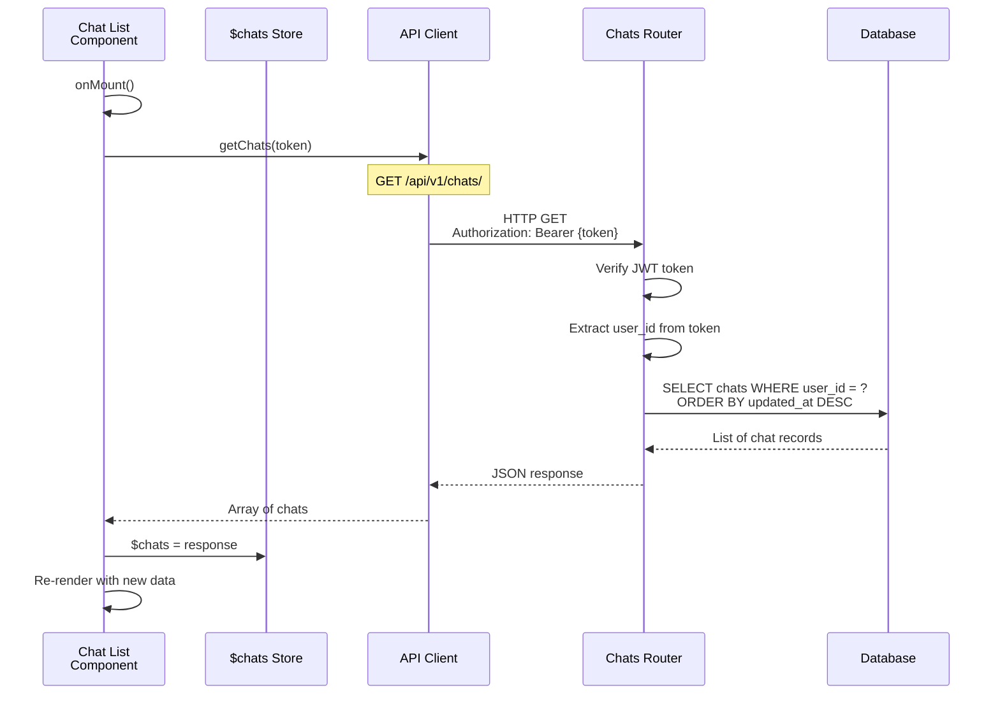
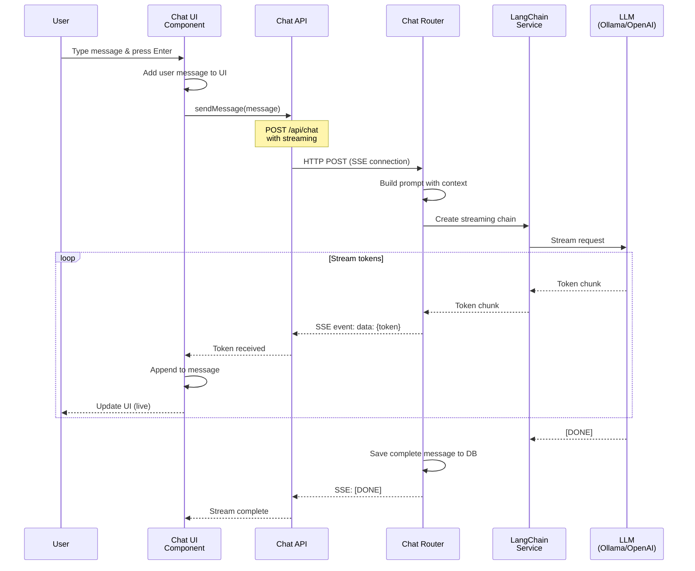
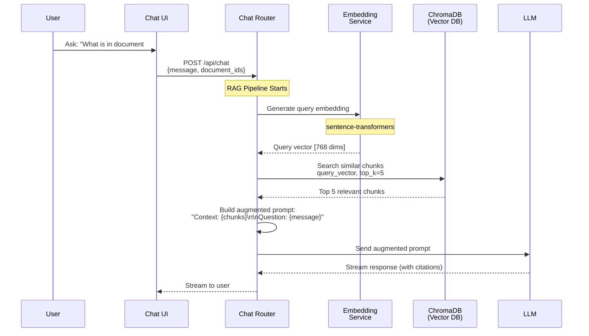
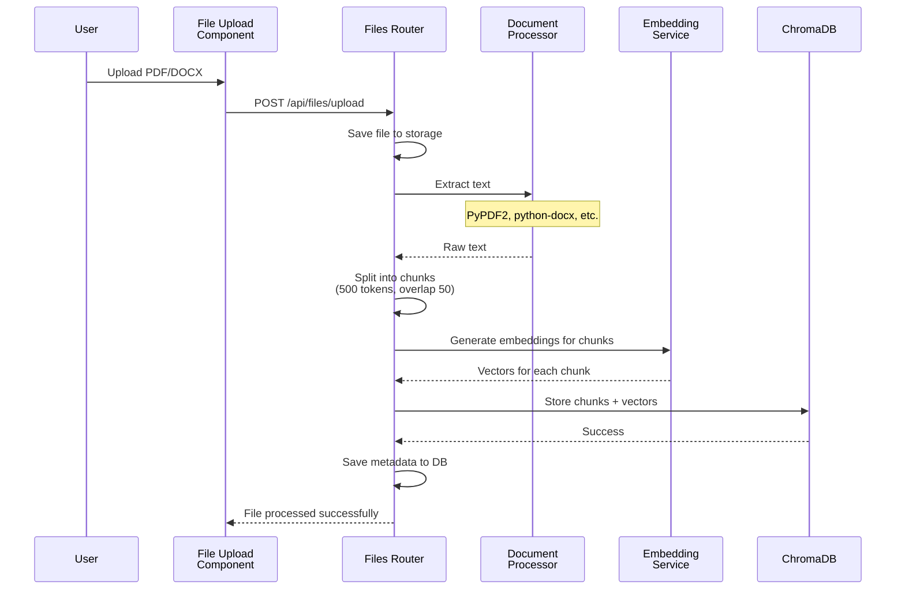
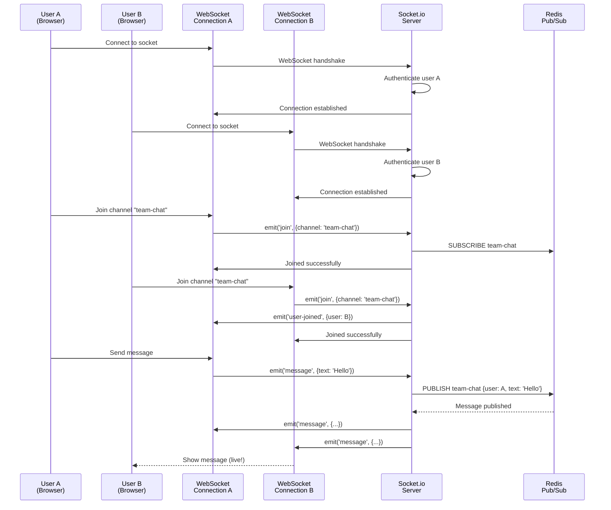
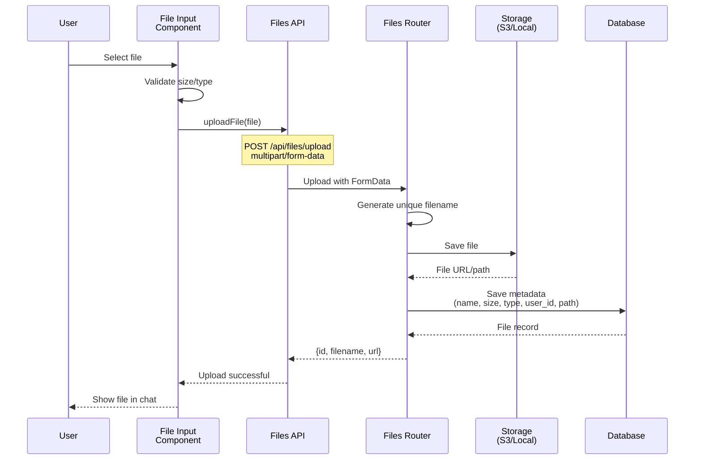
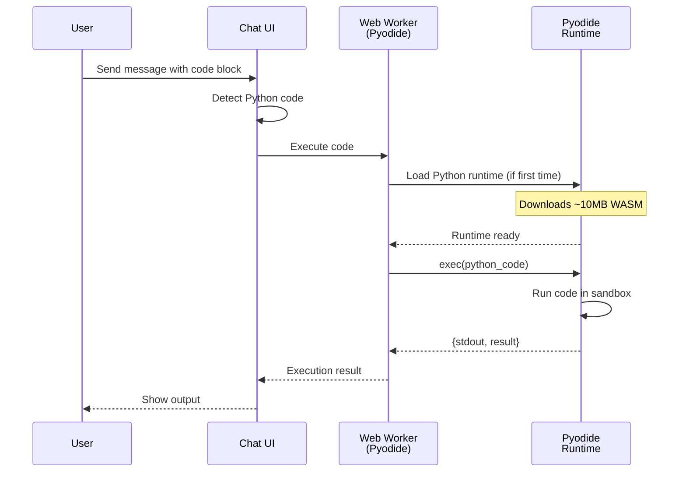

# Data Flow Guide

**Trace data through Open WebUI end-to-end.** Understand exactly how requests flow from user action to database and back.

**Estimated reading time:** 1.5-2 hours
**Prerequisites:** [ARCHITECTURE_OVERVIEW.md](./ARCHITECTURE_OVERVIEW.md), [TECH_STACK_GUIDE.md](./TECH_STACK_GUIDE.md)
**Documented:** November 18, 2025

---

## 📋 Table of Contents

1. [Overview](#overview)
2. [Authentication Flow](#authentication-flow)
3. [Simple API Request Flow](#simple-api-request-flow)
4. [Chat Message Flow (Streaming)](#chat-message-flow-streaming)
5. [RAG Query Flow](#rag-query-flow)
6. [Real-time Collaboration Flow](#real-time-collaboration-flow)
7. [File Upload Flow](#file-upload-flow)
8. [WebSocket Connection Flow](#websocket-connection-flow)
9. [Code Execution Flow (Pyodide)](#code-execution-flow-pyodide)
10. [Common Patterns](#common-patterns)
11. [Next Steps](#next-steps)

---

## Overview

### System Layers Recap

```
┌─────────────────────────────────────────┐
│  Browser (User Interface)               │  Layer 1: Presentation
├─────────────────────────────────────────┤
│  Svelte Components & Stores             │  Layer 2: Frontend State
├─────────────────────────────────────────┤
│  API Client Functions                   │  Layer 3: API Communication
├─────────────────────────────────────────┤
│  HTTP / WebSocket                       │  Layer 4: Network
├─────────────────────────────────────────┤
│  FastAPI Routers                        │  Layer 5: API Endpoints
├─────────────────────────────────────────┤
│  Business Logic Services                │  Layer 6: Application Logic
├─────────────────────────────────────────┤
│  SQLAlchemy Models                      │  Layer 7: Data Access
├─────────────────────────────────────────┤
│  Database (SQLite/PostgreSQL)           │  Layer 8: Persistence
└─────────────────────────────────────────┘
```

---

## Authentication Flow

### User Login (Complete Flow)



### Code Trace: Authentication

#### 1. Frontend: Login Form

**File:** [src/routes/auth/+page.svelte](../../src/routes/auth/+page.svelte)

```svelte
<script lang="ts">
  import { signin } from '$lib/apis/auths';
  import { user } from '$lib/stores';
  import { goto } from '$app/navigation';

  let email = $state('');
  let password = $state('');

  async function handleSignin() {
    try {
      const res = await signin(email, password);

      // Update global user store
      $user = res;

      // Save token
      localStorage.setItem('token', res.token);

      // Navigate to home
      goto('/');
    } catch (error) {
      console.error('Login failed:', error);
    }
  }
</script>

<form onsubmit={handleSignin}>
  <input type="email" bind:value={email} />
  <input type="password" bind:value={password} />
  <button type="submit">Sign In</button>
</form>
```

#### 2. API Client: signin()

**File:** [src/lib/apis/auths/index.ts](../../src/lib/apis/auths/)

```typescript
export const signin = async (email: string, password: string) => {
  const res = await fetch('/api/v1/auths/signin', {
    method: 'POST',
    headers: { 'Content-Type': 'application/json' },
    body: JSON.stringify({ email, password })
  });

  if (!res.ok) {
    const error = await res.json();
    throw new Error(error.detail);
  }

  return res.json();  // { token, user }
};
```

#### 3. Backend: Auth Router

**File:** [backend/open_webui/routers/auths.py](../../backend/open_webui/routers/auths.py)

```python
from fastapi import APIRouter, HTTPException
from pydantic import BaseModel
import bcrypt

router = APIRouter()

class SigninForm(BaseModel):
    email: str
    password: str

@router.post("/signin")
async def signin(form: SigninForm):
    # Get user from database
    user = Users.get_user_by_email(form.email)

    if not user:
        raise HTTPException(status_code=401, detail="Invalid credentials")

    # Verify password
    if not bcrypt.checkpw(
        form.password.encode('utf-8'),
        user.password.encode('utf-8')
    ):
        raise HTTPException(status_code=401, detail="Invalid credentials")

    # Generate JWT token
    token = create_token(data={"id": user.id})

    # Create session
    session = Sessions.insert_new_session(user.id, token)

    return {
        "token": token,
        "user": user.model_dump()
    }
```

#### 4. Database: User Model

**File:** [backend/open_webui/models/users.py](../../backend/open_webui/models/users.py)

```python
from sqlalchemy import select
from open_webui.internal.db import Base, get_db

class User(Base):
    __tablename__ = "user"

    id: Mapped[str] = mapped_column(String, primary_key=True)
    email: Mapped[str] = mapped_column(String, unique=True)
    password: Mapped[str] = mapped_column(String)
    # ...

class Users:
    @staticmethod
    def get_user_by_email(email: str) -> User | None:
        with get_db() as db:
            stmt = select(User).where(User.email == email)
            return db.scalar(stmt)
```

### 🎯 Key Takeaways

1. **JWT Tokens** - Stored in localStorage, sent with every request
2. **Password Hashing** - bcrypt, never store plain passwords
3. **Session Tracking** - Database records for active sessions
4. **Global State** - `$user` store updated on successful login

---

## Simple API Request Flow

### Fetching Chat List



### Code Trace: Get Chats

#### 1. Component: Load Chats

**File:** [src/routes/(app)/+layout.svelte](../../src/routes/(app)/+layout.svelte)

```svelte
<script lang="ts">
  import { onMount } from 'svelte';
  import { getChats } from '$lib/apis/chats';
  import { chats } from '$lib/stores';
  import { user } from '$lib/stores';

  onMount(async () => {
    if ($user) {
      const chatList = await getChats(localStorage.token);
      $chats = chatList;
    }
  });
</script>
```

#### 2. API Client

**File:** [src/lib/apis/chats/index.ts](../../src/lib/apis/chats/)

```typescript
export const getChats = async (token: string) => {
  const res = await fetch('/api/v1/chats/', {
    headers: {
      Authorization: `Bearer ${token}`
    }
  });

  return res.json();
};
```

#### 3. Backend Router

**File:** [backend/open_webui/routers/chats.py](../../backend/open_webui/routers/chats.py)

```python
from fastapi import APIRouter, Depends
from open_webui.models.chats import Chats
from open_webui.utils.auth import get_current_user

router = APIRouter()

@router.get("/")
async def get_chats(user=Depends(get_current_user)):
    # get_current_user validates token and returns user
    chats = Chats.get_chats_by_user_id(user.id)
    return chats
```

#### 4. Database Model

```python
class Chats:
    @staticmethod
    def get_chats_by_user_id(user_id: str):
        with get_db() as db:
            stmt = (
                select(Chat)
                .where(Chat.user_id == user_id)
                .order_by(Chat.updated_at.desc())
            )
            return db.scalars(stmt).all()
```

---

## Chat Message Flow (Streaming)

### LLM Streaming Response



### Code Trace: Streaming Chat

#### 1. Frontend: Send Message

**File:** [src/lib/components/chat/MessageInput.svelte](../../src/lib/components/chat/MessageInput.svelte)

```svelte
<script lang="ts">
  import { sendChatMessage } from '$lib/apis/chats';

  let message = $state('');
  let currentResponse = $state('');

  async function sendMessage() {
    const userMessage = message;
    message = '';  // Clear input

    // Show user message immediately
    addMessageToUI({ role: 'user', content: userMessage });

    // Create assistant message placeholder
    const assistantMessage = { role: 'assistant', content: '' };
    addMessageToUI(assistantMessage);

    // Stream response
    await sendChatMessage(
      userMessage,
      {
        onToken: (token) => {
          // Update message in real-time
          assistantMessage.content += token;
        },
        onDone: () => {
          console.log('Stream complete');
        }
      }
    );
  }
</script>

<input bind:value={message} onkeydown={(e) => e.key === 'Enter' && sendMessage()} />
```

#### 2. API Client with SSE

**File:** [src/lib/apis/chats/index.ts](../../src/lib/apis/chats/)

```typescript
export async function sendChatMessage(
  message: string,
  callbacks: { onToken: (token: string) => void; onDone: () => void }
) {
  const response = await fetch('/api/chat', {
    method: 'POST',
    headers: {
      'Content-Type': 'application/json',
      Authorization: `Bearer ${localStorage.token}`
    },
    body: JSON.stringify({ message })
  });

  const reader = response.body.getReader();
  const decoder = new TextDecoder();

  while (true) {
    const { done, value } = await reader.read();

    if (done) {
      callbacks.onDone();
      break;
    }

    const chunk = decoder.decode(value);
    const lines = chunk.split('\n');

    for (const line of lines) {
      if (line.startsWith('data: ')) {
        const data = line.slice(6);
        if (data === '[DONE]') {
          continue;
        }
        const parsed = JSON.parse(data);
        callbacks.onToken(parsed.token);
      }
    }
  }
}
```

#### 3. Backend: Streaming Endpoint

**File:** [backend/open_webui/routers/chats.py](../../backend/open_webui/routers/chats.py)

```python
from fastapi import APIRouter
from fastapi.responses import StreamingResponse
from langchain.callbacks.streaming_stdout import StreamingStdOutCallbackHandler

@router.post("/chat")
async def chat(
    request: ChatRequest,
    user=Depends(get_current_user)
):
    async def generate():
        # Build prompt
        messages = build_messages(request.message, context)

        # Stream from LLM
        async for token in stream_llm_response(messages):
            yield f"data: {json.dumps({'token': token})}\n\n"

        # Save to database
        save_message(user.id, request.message, full_response)

        yield "data: [DONE]\n\n"

    return StreamingResponse(
        generate(),
        media_type="text/event-stream"
    )
```

### 🎯 Key Takeaways

1. **Server-Sent Events (SSE)** - One-way streaming from server to client
2. **Real-time UI Updates** - Tokens appended as they arrive
3. **Optimistic UI** - User message shown immediately
4. **Database Save** - After stream completes

---

## RAG Query Flow

### Document Query with Vector Search



### Code Trace: RAG Query

#### 1. Frontend: Reference Document

```svelte
<script lang="ts">
  async function sendMessageWithDocs() {
    await sendChatMessage({
      message: userMessage,
      document_ids: ['doc-123']  // Reference document
    });
  }
</script>
```

#### 2. Backend: RAG Pipeline

**File:** [backend/open_webui/routers/retrieval.py](../../backend/open_webui/routers/retrieval.py)

```python
@router.post("/retrieval")
async def retrieve_context(query: str, document_ids: list[str]):
    # 1. Generate query embedding
    query_embedding = get_embedding_function()(query)

    # 2. Search vector database
    results = chroma_client.query(
        collection_name="documents",
        query_embeddings=[query_embedding],
        n_results=5,
        where={"document_id": {"$in": document_ids}}
    )

    # 3. Rerank results (optional)
    if ENABLE_RERANKING:
        results = rerank_results(query, results)

    # 4. Extract text chunks
    context_chunks = [r['text'] for r in results]

    return {"chunks": context_chunks}
```

#### 3. Augment Prompt

```python
async def chat_with_rag(message: str, document_ids: list[str]):
    # Get relevant context
    context = await retrieve_context(message, document_ids)

    # Build augmented prompt
    augmented_prompt = f"""
    Context from documents:
    {chr(10).join(context['chunks'])}

    Question: {message}

    Answer the question based on the context above.
    """

    # Send to LLM
    response = await llm.astream(augmented_prompt)
    return response
```

### Document Processing Flow



### 🎯 Key Takeaways

1. **Embedding Generation** - Query and documents become vectors
2. **Similarity Search** - Find chunks with similar meaning
3. **Context Injection** - Add relevant chunks to prompt
4. **Chunk Size** - Balance detail vs token limits (typically 500-1000 tokens)

---

## Real-time Collaboration Flow

### WebSocket Channel Updates



### Code Trace: WebSocket

#### 1. Frontend: Connect

**File:** [src/lib/stores/index.ts](../../src/lib/stores/)

```typescript
import { io } from 'socket.io-client';

export function connectSocket(token: string) {
  const socket = io('http://localhost:8080', {
    auth: { token }
  });

  socket.on('connect', () => {
    console.log('Connected to WebSocket');
  });

  socket.on('message', (data) => {
    // Update messages store
    messages.update(m => [...m, data]);
  });

  return socket;
}
```

#### 2. Join Channel

```typescript
function joinChannel(socket, channelId: string) {
  socket.emit('join-channel', { channel_id: channelId });

  socket.on('channel-joined', () => {
    console.log('Joined channel:', channelId);
  });

  socket.on('user-joined', (user) => {
    console.log('User joined:', user.name);
  });
}
```

#### 3. Backend: Socket Handler

**File:** [backend/open_webui/socket/main.py](../../backend/open_webui/socket/main.py)

```python
import socketio

sio = socketio.AsyncServer(async_mode='asgi', cors_allowed_origins='*')

@sio.event
async def connect(sid, environ, auth):
    # Verify JWT token
    token = auth.get('token')
    user = verify_token(token)

    if not user:
        raise ConnectionRefusedError('Invalid token')

    # Save user session
    await sio.save_session(sid, {'user_id': user.id})

    print(f'User {user.id} connected: {sid}')

@sio.event
async def join_channel(sid, data):
    channel_id = data['channel_id']
    session = await sio.get_session(sid)
    user_id = session['user_id']

    # Join Socket.io room
    sio.enter_room(sid, channel_id)

    # Notify other users
    await sio.emit(
        'user-joined',
        {'user_id': user_id},
        room=channel_id,
        skip_sid=sid
    )

@sio.event
async def message(sid, data):
    session = await sio.get_session(sid)
    user_id = session['user_id']
    channel_id = data['channel_id']

    # Broadcast to all in room
    await sio.emit(
        'message',
        {'user_id': user_id, 'text': data['text']},
        room=channel_id
    )

    # Save to database
    await save_message(channel_id, user_id, data['text'])
```

### 🎯 Key Takeaways

1. **Socket.io** - Abstraction over WebSockets with fallbacks
2. **Rooms** - Group connections (like channels)
3. **Pub/Sub** - Redis for multi-server scaling
4. **Authentication** - Verify on connect, store in session

---

## File Upload Flow



### Code Trace: File Upload

#### Frontend

```svelte
<script lang="ts">
  import { uploadFile } from '$lib/apis/files';

  let files = $state<FileList>();

  async function handleUpload() {
    for (const file of files) {
      const formData = new FormData();
      formData.append('file', file);

      const response = await uploadFile(formData);
      console.log('Uploaded:', response);
    }
  }
</script>

<input type="file" bind:files multiple />
<button onclick={handleUpload}>Upload</button>
```

#### Backend

```python
from fastapi import UploadFile

@router.post("/upload")
async def upload_file(
    file: UploadFile,
    user=Depends(get_current_user)
):
    # Generate unique filename
    filename = f"{uuid4()}_{file.filename}"

    # Save to storage
    file_path = await storage.save(filename, file.file)

    # Save metadata
    file_record = Files.insert_new_file(
        user.id,
        filename=file.filename,
        path=file_path,
        size=file.size,
        content_type=file.content_type
    )

    return file_record
```

---

## Code Execution Flow (Pyodide)

### Python in Browser



---

## Common Patterns

### Error Handling

```typescript
// Frontend
try {
  const data = await apiCall();
} catch (error) {
  if (error.status === 401) {
    // Unauthorized - redirect to login
    goto('/auth');
  } else if (error.status === 404) {
    // Not found - show error
    toast.error('Not found');
  } else {
    // Generic error
    toast.error('Something went wrong');
  }
}
```

```python
# Backend
from fastapi import HTTPException

@router.get("/resource/{id}")
async def get_resource(id: str):
    resource = await db.get(id)

    if not resource:
        raise HTTPException(status_code=404, detail="Resource not found")

    return resource
```

### Pagination

```typescript
// Frontend
async function loadMore() {
  const chats = await getChats({
    limit: 20,
    offset: currentChats.length
  });

  currentChats = [...currentChats, ...chats];
}
```

```python
# Backend
@router.get("/")
async def get_chats(
    limit: int = 20,
    offset: int = 0,
    user=Depends(get_current_user)
):
    stmt = (
        select(Chat)
        .where(Chat.user_id == user.id)
        .order_by(Chat.updated_at.desc())
        .limit(limit)
        .offset(offset)
    )

    chats = await db.execute(stmt)
    return chats.scalars().all()
```

### Caching with Redis

```python
from aiocache import cached

@cached(ttl=300)  # Cache for 5 minutes
async def get_expensive_data(id: str):
    # Expensive operation
    return data
```

---

## Next Steps

Now that you understand data flows:

1. 🎨 **Frontend patterns:** [FRONTEND_ARCHITECTURE.md](./FRONTEND_ARCHITECTURE.md)
   - Component patterns, state management

2. ⚙️ **Backend patterns:** [BACKEND_ARCHITECTURE.md](./BACKEND_ARCHITECTURE.md)
   - Router organization, database patterns

3. 🛠️ **Build features:** [HOW_TO_GUIDE.md](./HOW_TO_GUIDE.md)
   - Apply these patterns to add new features

4. 🔍 **Code tours:** [CODE_TOURS.md](./CODE_TOURS.md)
   - Walk through actual implementation

---

## Summary

**Key data flow patterns:**

✅ **RESTful APIs** - Standard HTTP for most operations
✅ **Server-Sent Events** - Streaming LLM responses
✅ **WebSockets** - Real-time collaboration
✅ **Vector Search** - RAG queries with embeddings
✅ **Async Throughout** - Both frontend and backend
✅ **Token Auth** - JWT in every request
✅ **Optimistic UI** - Show changes immediately

**Ready for deeper dives?** → [FRONTEND_ARCHITECTURE.md](./FRONTEND_ARCHITECTURE.md)

---

**Last updated:** November 18, 2025
**Tech stack research:** [TECH_STACK_RESEARCH.md](./TECH_STACK_RESEARCH.md)
